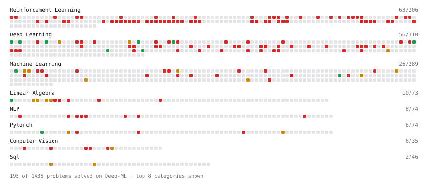

# Deep-ML

My machine learning practice from [Deep-ML](https://www.deep-ml.com). Every solution here was written by hand.

**109** solved · 73 problems · 36 labs · 0 math

[**Browse the interactive portfolio**](https://avikds.github.io/deep-ml/) to replay this filling in over time.

## Problems

| | Difficulty | Solved | |
| --- | --- | --- | --- |
| [Compare Naive vs Stable Softmax for Attention Scores](https://www.deep-ml.com/problems/962) | easy | 2026-09-06 | [solution](problems/0962-compare-naive-vs-stable-softmax-for-attention-scores) |
| [Compute Multi-class Cross-Entropy Loss](https://www.deep-ml.com/problems/134) | easy | 2026-09-06 | [solution](problems/0134-compute-multi-class-cross-entropy-loss) |
| [Implement Global Average Pooling](https://www.deep-ml.com/problems/114) | easy | 2026-09-08 | [solution](problems/0114-implement-global-average-pooling) |
| [Implement ReLU Activation Function](https://www.deep-ml.com/problems/42) | easy | 2026-09-06 | [solution](problems/0042-implement-relu-activation-function) |
| [Implement Xavier/Glorot Weight Initialization](https://www.deep-ml.com/problems/369) | easy | 2026-09-06 | [solution](problems/0369-implement-xavier-glorot-weight-initialization) |
| [Linear Regression Using Gradient Descent](https://www.deep-ml.com/problems/15) | easy | 2026-09-06 | [solution](problems/0015-linear-regression-using-gradient-descent) |
| [Matrix-Vector Dot Product](https://www.deep-ml.com/problems/1) | easy | 2026-08-20 | [solution](problems/0001-matrix-vector-dot-product) |
| [Sigmoid Activation Function Understanding](https://www.deep-ml.com/problems/22) | easy | 2026-09-06 | [solution](problems/0022-sigmoid-activation-function-understanding) |
| [Single Neuron](https://www.deep-ml.com/problems/24) | easy | 2026-09-06 | [solution](problems/0024-single-neuron) |
| [Your First Gradient with jax.grad](https://www.deep-ml.com/problems/1325) | easy | 2026-09-10 | [solution](problems/1325-your-first-gradient-with-jax-grad) |
| [Backpropagation Gradients for a Dense Layer](https://www.deep-ml.com/problems/1076) | medium | 2026-09-06 | [solution](problems/1076-backpropagation-gradients-for-a-dense-layer) |
| [Calculate Eigenvalues of a Matrix](https://www.deep-ml.com/problems/6) | medium | 2026-08-20 | [solution](problems/0006-calculate-eigenvalues-of-a-matrix) |
| [Implement BatchNorm2d from Scratch (training mode)](https://www.deep-ml.com/problems/902) | medium | 2026-09-07 | [solution](problems/0902-implement-batchnorm2d-from-scratch-training-mode) |
| [Implement K-Fold Cross-Validation](https://www.deep-ml.com/problems/18) | medium | 2026-08-25 | [solution](problems/0018-implement-k-fold-cross-validation) |
| [Implement Layer Normalization for Sequence Data](https://www.deep-ml.com/problems/109) | medium | 2026-09-03 | [solution](problems/0109-implement-layer-normalization-for-sequence-data) |
| [Implement Masked Self-Attention](https://www.deep-ml.com/problems/107) | medium | 2026-09-03 | [solution](problems/0107-implement-masked-self-attention) |
| [Implement Self-Attention Mechanism](https://www.deep-ml.com/problems/53) | medium | 2026-09-03 | [solution](problems/0053-implement-self-attention-mechanism) |
| [K-Means Clustering](https://www.deep-ml.com/problems/17) | medium | 2026-08-25 | [solution](problems/0017-k-means-clustering) |
| [Matrix times Matrix ](https://www.deep-ml.com/problems/9) | medium | 2026-08-25 | [solution](problems/0009-matrix-times-matrix) |
| [Matrix Transformation ](https://www.deep-ml.com/problems/7) | medium | 2026-08-25 | [solution](problems/0007-matrix-transformation) |
| [Numerical Gradient Checking](https://www.deep-ml.com/problems/313) | medium | 2026-09-06 | [solution](problems/0313-numerical-gradient-checking) |
| [Sigmoidal Accuracy-to-Log-Likelihood Scaling Law Fit](https://www.deep-ml.com/problems/790) | medium | 2026-09-09 | [solution](problems/0790-sigmoidal-accuracy-to-log-likelihood-scaling-law-fit) |
| [Solve Linear Equations using Jacobi Method](https://www.deep-ml.com/problems/11) | medium | 2026-08-25 | [solution](problems/0011-solve-linear-equations-using-jacobi-method) |
| [3D CNN Forward Pass Implementation](https://www.deep-ml.com/problems/230) | hard | 2026-09-06 | [solution](problems/0230-3d-cnn-forward-pass-implementation) |
| [A/B Test Statistical Analysis for Model Comparison](https://www.deep-ml.com/problems/269) | hard | 2026-09-06 | [solution](problems/0269-a-b-test-statistical-analysis-for-model-comparison) |
| [Combined Token Sampling Pipeline (Temperature + Top-k + Top-p)](https://www.deep-ml.com/problems/419) | hard | 2026-09-10 | [solution](problems/0419-combined-token-sampling-pipeline-temperature-top-k-top-p) |
| [Context Parallelism with Ring Attention for Video Models](https://www.deep-ml.com/problems/448) | hard | 2026-09-10 | [solution](problems/0448-context-parallelism-with-ring-attention-for-video-models) |
| [Decision Tree Learning](https://www.deep-ml.com/problems/20) | hard | 2026-08-25 | [solution](problems/0020-decision-tree-learning) |
| [Determinant of a 4x4 Matrix using Laplace's Expansion (hard)](https://www.deep-ml.com/problems/13) | hard | 2026-08-25 | [solution](problems/0013-determinant-of-a-4x4-matrix-using-laplace-s-expansion-hard) |
| [Disaggregated Prefill-Decode Serving Simulator](https://www.deep-ml.com/problems/440) | hard | 2026-09-10 | [solution](problems/0440-disaggregated-prefill-decode-serving-simulator) |
| [Flash Attention v1 - Forward Pass](https://www.deep-ml.com/problems/208) | hard | 2026-09-06 | [solution](problems/0208-flash-attention-v1-forward-pass) |
| [FP4 Quantization with Microscaling (MXFP4)](https://www.deep-ml.com/problems/427) | hard | 2026-09-10 | [solution](problems/0427-fp4-quantization-with-microscaling-mxfp4) |
| [Gambler's Problem: Value Iteration](https://www.deep-ml.com/problems/164) | hard | 2026-09-06 | [solution](problems/0164-gambler-s-problem-value-iteration) |
| [Gaussian Process for Regression](https://www.deep-ml.com/problems/186) | hard | 2026-09-06 | [solution](problems/0186-gaussian-process-for-regression) |
| [GPT-2 Text Generation](https://www.deep-ml.com/problems/88) | hard | 2026-09-06 | [solution](problems/0088-gpt-2-text-generation) |
| [GSPO: Group Sequence Policy Optimization](https://www.deep-ml.com/problems/209) | hard | 2026-09-06 | [solution](problems/0209-gspo-group-sequence-policy-optimization) |
| [Implement a Dense Block with 2D Convolutions](https://www.deep-ml.com/problems/137) | hard | 2026-09-06 | [solution](problems/0137-implement-a-dense-block-with-2d-convolutions) |
| [Implement a Simple CNN Training Function with Backpropagation](https://www.deep-ml.com/problems/130) | hard | 2026-09-06 | [solution](problems/0130-implement-a-simple-cnn-training-function-with-backpropagation) |
| [Implement a Simple RNN with Backpropagation Through Time (BPTT)](https://www.deep-ml.com/problems/62) | hard | 2026-09-06 | [solution](problems/0062-implement-a-simple-rnn-with-backpropagation-through-time-bptt) |
| [Implement a Sparse Mixture of Experts Layer](https://www.deep-ml.com/problems/125) | hard | 2026-09-06 | [solution](problems/0125-implement-a-sparse-mixture-of-experts-layer) |
| [Implement AdaBoost Fit Method](https://www.deep-ml.com/problems/38) | hard | 2026-09-06 | [solution](problems/0038-implement-adaboost-fit-method) |
| [Implement Bagging Classifier from Scratch](https://www.deep-ml.com/problems/307) | hard | 2026-09-06 | [solution](problems/0307-implement-bagging-classifier-from-scratch) |
| [Implement Core MDN Residualization](https://www.deep-ml.com/problems/358) | hard | 2026-09-09 | [solution](problems/0358-implement-core-mdn-residualization) |
| [Implement LLE (Locally Linear Embedding)](https://www.deep-ml.com/problems/351) | hard | 2026-09-09 | [solution](problems/0351-implement-lle-locally-linear-embedding) |
| [Implement Multi-Head Attention](https://www.deep-ml.com/problems/94) | hard | 2026-09-03 | [solution](problems/0094-implement-multi-head-attention) |
| [Implement Sigmoid MoE Router with Bias Correction](https://www.deep-ml.com/problems/458) | hard | 2026-09-10 | [solution](problems/0458-implement-sigmoid-moe-router-with-bias-correction) |
| [Implement Speculative Decoding Verification](https://www.deep-ml.com/problems/394) | hard | 2026-09-10 | [solution](problems/0394-implement-speculative-decoding-verification) |
| [Implement Stacking Classifier](https://www.deep-ml.com/problems/346) | hard | 2026-09-06 | [solution](problems/0346-implement-stacking-classifier) |
| [Implement the Conjugate Gradient Method for Solving Linear Systems](https://www.deep-ml.com/problems/63) | hard | 2026-09-06 | [solution](problems/0063-implement-the-conjugate-gradient-method-for-solving-linear-systems) |
| [Implement the GRPO Objective Function](https://www.deep-ml.com/problems/101) | hard | 2026-09-06 | [solution](problems/0101-implement-the-grpo-objective-function) |
| [Implementing a Custom Dense Layer in Python](https://www.deep-ml.com/problems/40) | hard | 2026-08-25 | [solution](problems/0040-implementing-a-custom-dense-layer-in-python) |
| [MDN with Label Collinearity Control](https://www.deep-ml.com/problems/360) | hard | 2026-09-10 | [solution](problems/0360-mdn-with-label-collinearity-control) |
| [ML Pipeline DAG Scheduler with Critical Path Analysis](https://www.deep-ml.com/problems/270) | hard | 2026-09-06 | [solution](problems/0270-ml-pipeline-dag-scheduler-with-critical-path-analysis) |
| [Monte Carlo Tree Search](https://www.deep-ml.com/problems/207) | hard | 2026-09-06 | [solution](problems/0207-monte-carlo-tree-search) |
| [Multi-Head Latent Attention (MLA)](https://www.deep-ml.com/problems/405) | hard | 2026-09-10 | [solution](problems/0405-multi-head-latent-attention-mla) |
| [Non-Maximum Suppression for Object Detection](https://www.deep-ml.com/problems/242) | hard | 2026-09-06 | [solution](problems/0242-non-maximum-suppression-for-object-detection) |
| [NoPE (No Positional Embedding) with iRoPE Attention](https://www.deep-ml.com/problems/406) | hard | 2026-09-10 | [solution](problems/0406-nope-no-positional-embedding-with-irope-attention) |
| [Number Format Precision Comparison (FP16 vs BF16 vs FP8 vs FP4)](https://www.deep-ml.com/problems/428) | hard | 2026-09-10 | [solution](problems/0428-number-format-precision-comparison-fp16-vs-bf16-vs-fp8-vs-fp4) |
| [Off-Policy Monte Carlo Control with Weighted Importance Sampling](https://www.deep-ml.com/problems/474) | hard | 2026-09-06 | [solution](problems/0474-off-policy-monte-carlo-control-with-weighted-importance-sampling) |
| [PCA Color Augmentation](https://www.deep-ml.com/problems/191) | hard | 2026-09-06 | [solution](problems/0191-pca-color-augmentation) |
| [Pegasos Kernel SVM Implementation](https://www.deep-ml.com/problems/21) | hard | 2026-08-25 | [solution](problems/0021-pegasos-kernel-svm-implementation) |
| [Policy Gradient with REINFORCE](https://www.deep-ml.com/problems/122) | hard | 2026-09-06 | [solution](problems/0122-policy-gradient-with-reinforce) |
| [Positional Encoding Calculator](https://www.deep-ml.com/problems/85) | hard | 2026-09-03 | [solution](problems/0085-positional-encoding-calculator) |
| [QR Decomposition](https://www.deep-ml.com/problems/201) | hard | 2026-09-06 | [solution](problems/0201-qr-decomposition) |
| [Singular Value Decomposition (SVD) of 2x2 Matrix](https://www.deep-ml.com/problems/12) | hard | 2026-08-20 | [solution](problems/0012-singular-value-decomposition-svd-of-2x2-matrix) |
| [Speculative Decoding End-to-End Simulation](https://www.deep-ml.com/problems/410) | hard | 2026-09-10 | [solution](problems/0410-speculative-decoding-end-to-end-simulation) |
| [SVD of a 2x2 Matrix](https://www.deep-ml.com/problems/28) | hard | 2026-08-25 | [solution](problems/0028-svd-of-a-2x2-matrix) |
| [TD(λ) with Eligibility Traces](https://www.deep-ml.com/problems/274) | hard | 2026-09-06 | [solution](problems/0274-td-with-eligibility-traces) |
| [Train a Simple GAN on 1D Gaussian Data](https://www.deep-ml.com/problems/174) | hard | 2026-09-06 | [solution](problems/0174-train-a-simple-gan-on-1d-gaussian-data) |
| [Train Logistic Regression with Gradient Descent](https://www.deep-ml.com/problems/106) | hard | 2026-09-06 | [solution](problems/0106-train-logistic-regression-with-gradient-descent) |
| [Train Softmax Regression with Gradient Descent](https://www.deep-ml.com/problems/105) | hard | 2026-09-06 | [solution](problems/0105-train-softmax-regression-with-gradient-descent) |
| [Two-Sample T-Test Implementation](https://www.deep-ml.com/problems/211) | hard | 2026-09-06 | [solution](problems/0211-two-sample-t-test-implementation) |
| [Variational Inference: ELBO Computation](https://www.deep-ml.com/problems/206) | hard | 2026-09-06 | [solution](problems/0206-variational-inference-elbo-computation) |

## Labs

| | Difficulty | Solved | |
| --- | --- | --- | --- |
| [Design Your Own Activation Function](https://www.deep-ml.com/labs/9) | easy | 2026-09-10 | [solution](labs/0009-design-your-own-activation-function) |
| [PyTorch: Build a Complete Training Loop](https://www.deep-ml.com/labs/13) | easy | 2026-09-10 | [solution](labs/0013-pytorch-build-a-complete-training-loop) |
| [Train a Binary Classifier](https://www.deep-ml.com/labs/23) | easy | 2026-08-20 | [solution](labs/0023-train-a-binary-classifier) |
| [Train a Linear Regression Model](https://www.deep-ml.com/labs/18) | easy | 2026-08-26 | [solution](labs/0018-train-a-linear-regression-model) |
| [Build a Tokenizer for Language Modeling](https://www.deep-ml.com/labs/19) | medium | 2026-09-10 | [solution](labs/0019-build-a-tokenizer-for-language-modeling) |
| [Combine Trained Models into an Ensemble](https://www.deep-ml.com/labs/27) | medium | 2026-09-05 | [solution](labs/0027-combine-trained-models-into-an-ensemble) |
| [Data Preprocessing: Handling Missing Values](https://www.deep-ml.com/labs/11) | medium | 2026-08-26 | [solution](labs/0011-data-preprocessing-handling-missing-values) |
| [Design Your Own Attention Mechanism](https://www.deep-ml.com/labs/10) | medium | 2026-09-10 | [solution](labs/0010-design-your-own-attention-mechanism) |
| [Design Your Own MoE Router](https://www.deep-ml.com/labs/25) | medium | 2026-09-06 | [solution](labs/0025-design-your-own-moe-router) |
| [Design Your Own Optimizer (NumPy)](https://www.deep-ml.com/labs/8) | medium | 2026-09-01 | [solution](labs/0008-design-your-own-optimizer-numpy) |
| [Design Your Own PTQ](https://www.deep-ml.com/labs/36) | medium | 2026-08-20 | [solution](labs/0036-design-your-own-ptq) |
| [Design Your Own Tabular Classifier](https://www.deep-ml.com/labs/35) | medium | 2026-08-21 | [solution](labs/0035-design-your-own-tabular-classifier) |
| [Few-Shot Classification with Cluster-Based Label Propagation](https://www.deep-ml.com/labs/28) | medium | 2026-09-04 | [solution](labs/0028-few-shot-classification-with-cluster-based-label-propagation) |
| [Fit Linear Regression with Autograd](https://www.deep-ml.com/labs/9ff596ea-672e-4101-9ce4-0856c55b62c9) | medium | 2026-09-10 | [solution](labs/9ff596ea-672e-4101-9ce4-0856c55b62c9-fit-linear-regression-with-autograd) |
| [Fix Overfitting with Regularization (NumPy)](https://www.deep-ml.com/labs/21) | medium | 2026-09-06 | [solution](labs/0021-fix-overfitting-with-regularization-numpy) |
| [MLP with Dropout and BatchNorm](https://www.deep-ml.com/labs/3480fd6b-ee7a-4afd-ba4b-5c934aeab10b) | medium | 2026-09-10 | [solution](labs/3480fd6b-ee7a-4afd-ba4b-5c934aeab10b-mlp-with-dropout-and-batchnorm) |
| [MNIST: Design Your Own Pytorch Optimizer](https://www.deep-ml.com/labs/3) | medium | 2026-09-04 | [solution](labs/0003-mnist-design-your-own-pytorch-optimizer) |
| [MNIST: Design Your Own Tinygrad Optimizer](https://www.deep-ml.com/labs/32) | medium | 2026-09-03 | [solution](labs/0032-mnist-design-your-own-tinygrad-optimizer) |
| [MNIST: Design-Your-Own tiny Pytorch Model](https://www.deep-ml.com/labs/2) | medium | 2026-09-06 | [solution](labs/0002-mnist-design-your-own-tiny-pytorch-model) |
| [MNIST: Design-Your-Own Tiny Tinygrad Model](https://www.deep-ml.com/labs/31) | medium | 2026-09-04 | [solution](labs/0031-mnist-design-your-own-tiny-tinygrad-model) |
| [MNIST: Fix Very Deep Network Training](https://www.deep-ml.com/labs/7) | medium | 2026-09-01 | [solution](labs/0007-mnist-fix-very-deep-network-training) |
| [MNIST: Pytorch DataLoader](https://www.deep-ml.com/labs/1) | medium | 2026-08-31 | [solution](labs/0001-mnist-pytorch-dataloader) |
| [MNIST: Tinygrad Data Transform](https://www.deep-ml.com/labs/30) | medium | 2026-09-04 | [solution](labs/0030-mnist-tinygrad-data-transform) |
| [Numpy: Design Your Own Dimensionality Reduction](https://www.deep-ml.com/labs/14) | medium | 2026-08-26 | [solution](labs/0014-numpy-design-your-own-dimensionality-reduction) |
| [PyTorch: Implement Your Own Gradient Descent Training Step](https://www.deep-ml.com/labs/12) | medium | 2026-08-26 | [solution](labs/0012-pytorch-implement-your-own-gradient-descent-training-step) |
| [Tinygrad: Implement Your Own Gradient Descent Training Step](https://www.deep-ml.com/labs/33) | medium | 2026-09-03 | [solution](labs/0033-tinygrad-implement-your-own-gradient-descent-training-step) |
| [Train a Tabular Policy with DPO](https://www.deep-ml.com/labs/37) | medium | 2026-09-10 | [solution](labs/0037-train-a-tabular-policy-with-dpo) |
| [Build a Digit Classifier from Scratch](https://www.deep-ml.com/labs/20) | hard | 2026-08-26 | [solution](labs/0020-build-a-digit-classifier-from-scratch) |
| [Build a Tree for a Random Forest](https://www.deep-ml.com/labs/26) | hard | 2026-08-26 | [solution](labs/0026-build-a-tree-for-a-random-forest) |
| [Design Your Own Latent Dynamics: Self-Speculative Decoding on TinyStories](https://www.deep-ml.com/labs/442392d7-09c3-4535-94f5-3aa8f288cce5) | hard | 2026-09-07 | [solution](labs/442392d7-09c3-4535-94f5-3aa8f288cce5-design-your-own-latent-dynamics-self-speculative-decoding-on-tinystories) |
| [Feature Deconfounder for Biased Image Data](https://www.deep-ml.com/labs/16) | hard | 2026-08-21 | [solution](labs/0016-feature-deconfounder-for-biased-image-data) |
| [Fine-Tune DistilGPT2 on TinyStories](https://www.deep-ml.com/labs/29) | hard | 2026-08-26 | [solution](labs/0029-fine-tune-distilgpt2-on-tinystories) |
| [MNIST: Adversarial Example Generation](https://www.deep-ml.com/labs/5) | hard | 2026-08-24 | [solution](labs/0005-mnist-adversarial-example-generation) |
| [MNIST: Build Neural Network from Scratch (NumPy Only)](https://www.deep-ml.com/labs/6) | hard | 2026-08-24 | [solution](labs/0006-mnist-build-neural-network-from-scratch-numpy-only) |
| [MNIST: Classification Loss (with Gradient)](https://www.deep-ml.com/labs/4) | hard | 2026-08-26 | [solution](labs/0004-mnist-classification-loss-with-gradient) |
| [Train a Tiny CNN Image Classifier](https://www.deep-ml.com/labs/91c76ab2-7d3a-43a7-98ce-385aab6f1691) | hard | 2026-08-26 | [solution](labs/91c76ab2-7d3a-43a7-98ce-385aab6f1691-train-a-tiny-cnn-image-classifier) |

---

_This file is regenerated by Deep-ML on every push._
